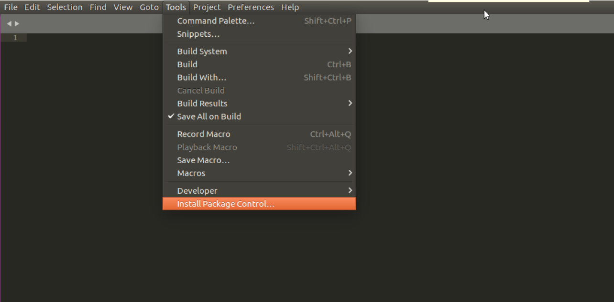
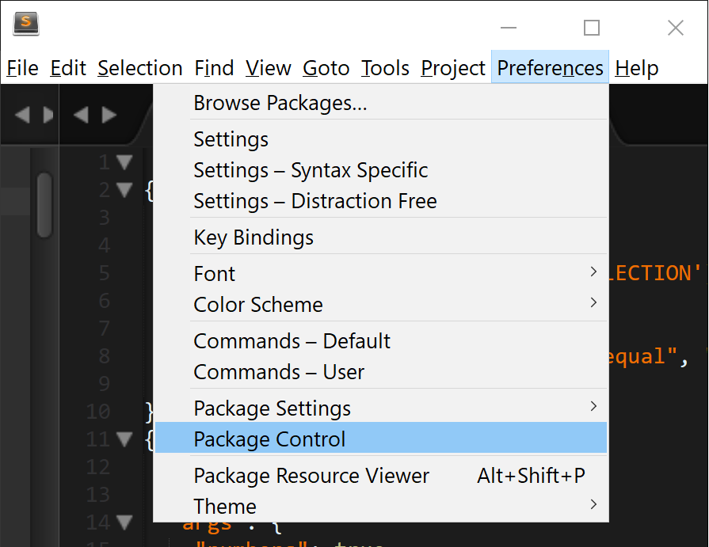
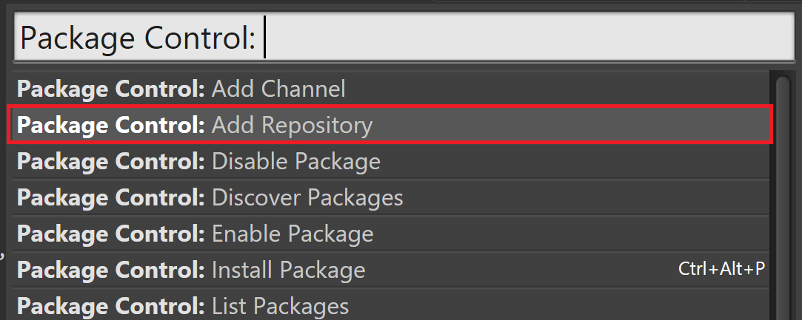
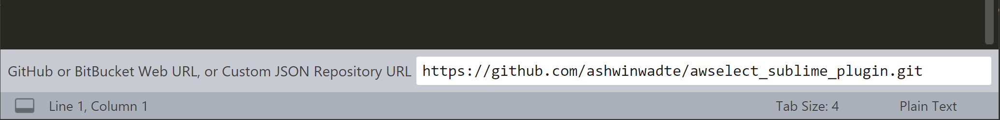
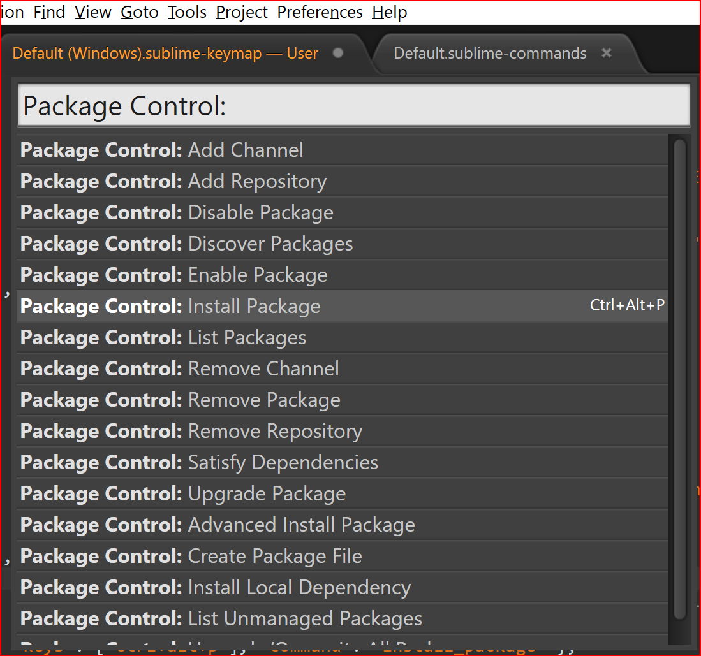

# awselect_sublime_plugin
Extract the text between matching words to new file

### Usage
1. Select the word and press `Ctrl + d` to select the two matching words. 
2. Now press `Ctrl + Shift + x` or right click and select `Awselecttofile` option.
3. This will extract the text between matching words to new file.

### Example
```
this is line one
test_extract
this is line two
this is line three
test_extract
this is line four
```

If I select both test_extract using `Ctrl + d` and then press `Ctrl + Shift + x`, it will output following text in new file.

```
test_extract
this is line two
this is line three
test_extract
```

### Installation
1. If Package Control is not installed, in Sublime Text, go to `Tools -> Install Package Controll...`




2. Open Package Control - `Preferences -> Package Control`




3. Select `Package Control: Add Repository`




4. At the bottom of the Sublime window, a input will appear, copy and paste the URL: `https://github.com/ashwinwadte/awselect_sublime_plugin` 




5. Open Package Control again - Preferences -> Package Control


6. Select `Package Control: Install Packages`




7. Now if you right click, you can see `Awselecttofile` option added to your context menu.
